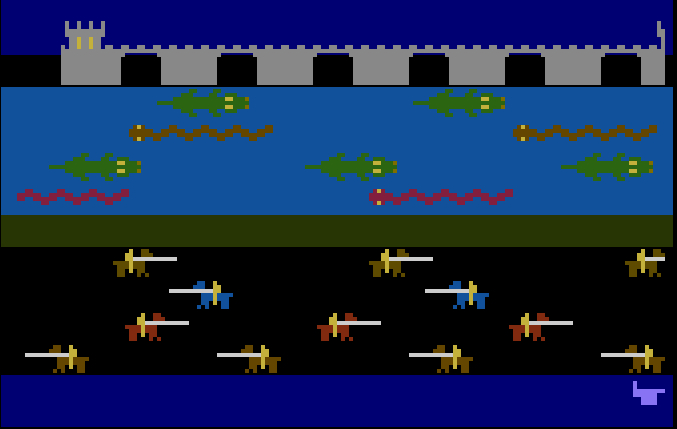

# edfries-frog
Princess and Frog game by Ed Fries for Atari 8-bit computers

Published by Romox for Atari 8-bit computers, by Ed Fries. Coded in 6502 assembly language with Atari Macro Assembler. 

The XFD file is the canonical source, in an Atari disk image format, from Ed. The .src files were exported by me (Kay Savetz) for easier reading on modern computers.

Ed has released this code under the MIT License. 

